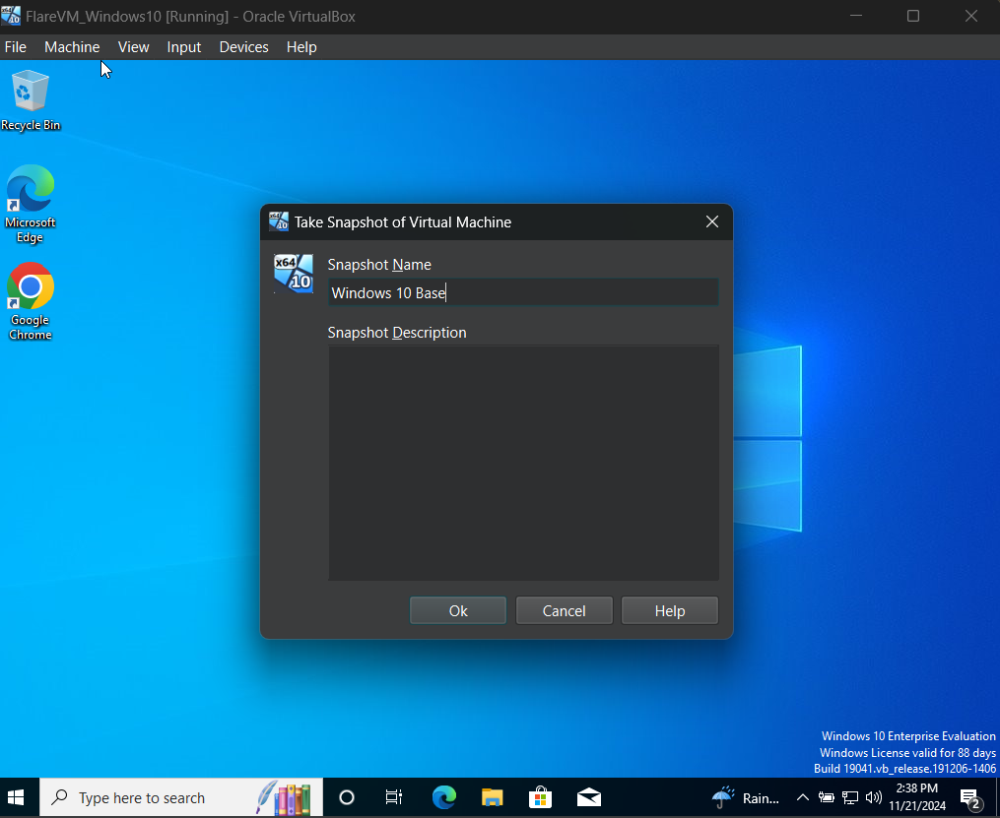

# Project 1: Wireshark: Capture Packets

## Description
 First I installed wireshark onto my ubantu linux OS.
 Next I captured a TCP packed on a Webdite.

 


Next I capured tcp packges and filltered by ip and port 443 (HTTPS).


* * *

# Project 2: TCPdump logging tool

## Description

I wrote code to capure and save TCP data


I Saved TCP data into wireshark for futher analsys


I saved multipe files of TCP data that were 1000 byte long


Using sslkey file to safe keys and help decrypt files 


# Project 3: Malware Creation

## Description

RandomWare: i craeted a simpe ransomware to study in my malware lab by,
  1. Created a basic encryption scriped/Ransomware in python 


  2. Created a decryption scriped in python that was copyed from the encrypttion scriped


 I made this randome ware so I can use it for my Malware analysis Lab


# Project 4: SIEM TOOL

## Description

Created a elastic account


# Project 5: Malware analysis Lab


## Description

In this project I created a iolated malware analysis enviorment 

I used a windows 10 VM where I was going to get malware and I used REMnux for anaylsis

I created a snappshot of Windows to reshort if somthing went wrong in the installation of flare




# Project 6: Vunalbillity Managment System 

## Description

# Project 7: Bootible Flash Drive

## Description


<dl>
<dt>Name</dt>
<dd>Conner Cunningham</dd>
<dt>Born</dt>
<dd>2002</dd>
<dt>Birthplace</dt>
<dd>Canada</dd>
</dl>

```
Long, single-line code blocks should not wrap. They should horizontally scroll if they are too long. This line should be long enough to demonstrate this.
```

```
The final element.
```
