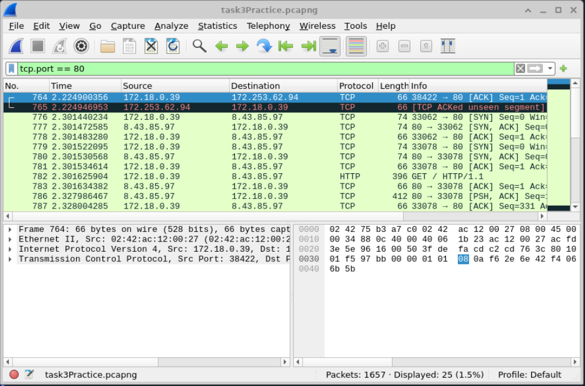
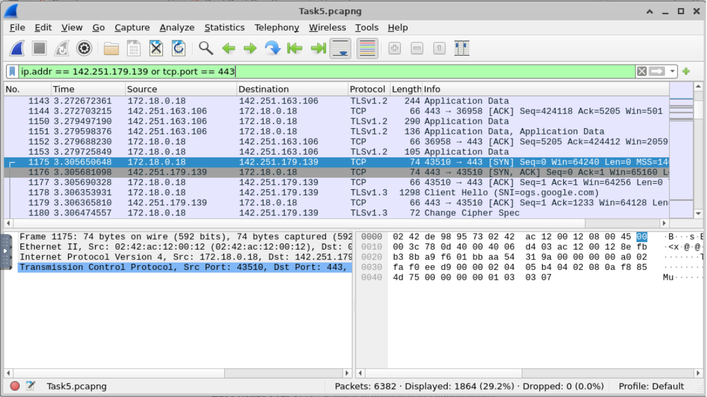
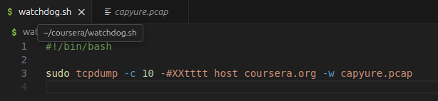
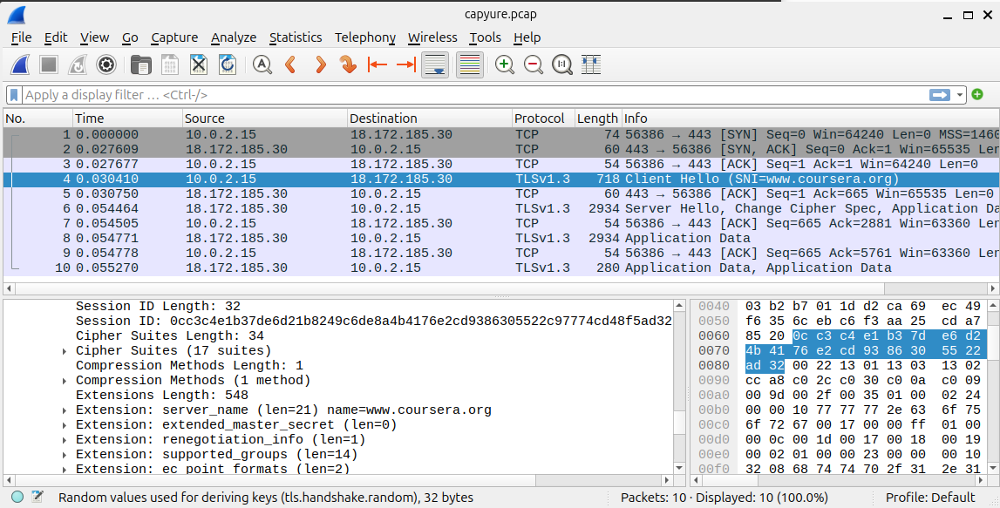
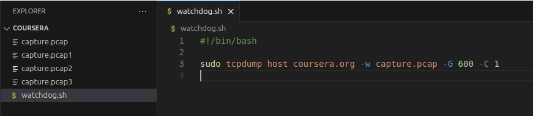
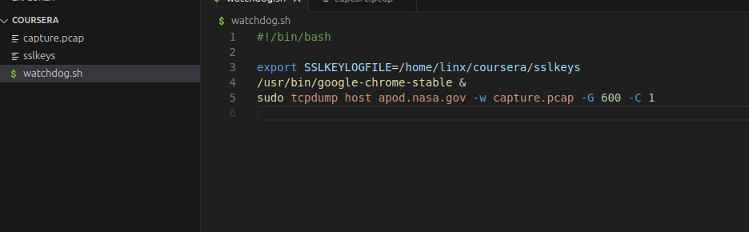
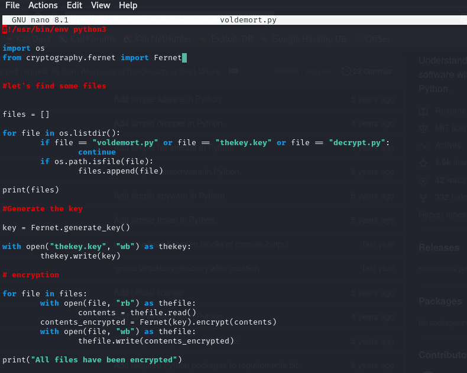
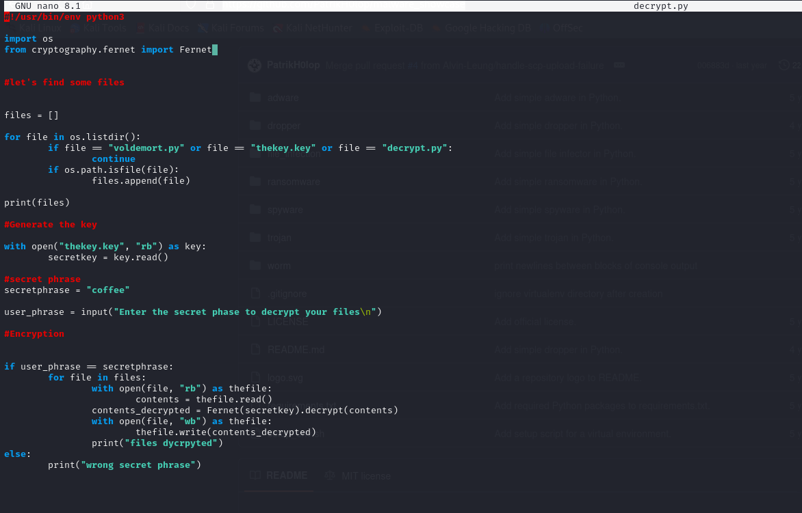

Text can be **bold**, _italic_, ~~strikethrough~~ or `keyword`.

[Link to another page](./another-page.html).


There should be whitespace between paragraphs. We recommend including a README, or a file with information about your project.

# Project 1: Wireshark: Capture Packets

## Description
 First I installed wireshark onto an ubantu linux.
 Secoundly I made sure to add a user to wireshark so I do not use it as a super user.
 Thirdly I capuserd packed on a net work.

 


Forthly I capured tcp packges and filltered by ip and port 443 (HTTPS).





//There's a horizontal rule below this.

* * *

# Project 2: TCPdump logging tool

I wrote code to capure and save TCP data





I Saved TCP data into wireshark for futher analsis





I saved multipe files of TCP data that were 1000 byte long





useing sslkey file to safe keys and help decrypt files 





# Project 3: Malware Creation

RandomWare: i craeted a simpe ransomware to study in my malware lab by,
  1. creating a encryption scriped in python



  2. created a decryption scriped in python that was copyed from the encrypttion scriped




 I made this randome ware so I can use it for my Malware analysis Lab

# Project 4: Malware analysis Lab

In this project I created a iolated malware analysis enviorment 

I used a windows 10 VM where I was going to get malware and I used REMnux for anaylsis

i created a snappshot of Windows to reshort if somthing went wrong


### Small image


### Definition lists can be used with HTML syntax.

<dl>
<dt>Name</dt>
<dd>Conner Cunningham</dd>
<dt>Born</dt>
<dd>2002</dd>
<dt>Birthplace</dt>
<dd>Canada</dd>
</dl>

```
Long, single-line code blocks should not wrap. They should horizontally scroll if they are too long. This line should be long enough to demonstrate this.
```

```
The final element.
```
